<!-- Public repository named exactly: asmamasrafi  →  README.md + assets/banner.svg + assets/divider.svg -->

<div align="center">



<br/>

<a href="https://github.com/asmamasrafi">
  
</a>

<br/><br/>

<a href="https://www.linkedin.com/in/assma-masrafi"></a>
<a href="mailto:asmamasrafi.2004@gmail.com"></a>


</div>



## `> whoami`

```bash
assma@ensa-agadir:~$ cat profile.yml

name:        Assma Masrafi
role:        Cybersecurity Engineering Student (class of 2027)
focus:       [threat-detection, security-audits, security-governance]
mindset:     understand a threat → detect it → turn findings into clear actions
seeking:     6-month end-of-studies internship (PFE) · starting January 2027
where:       Morocco · France · International
status:      🟢 available
```

> 🇫🇷 *Étudiante ingénieure en cybersécurité (ENSA Agadir, promotion 2027), à la recherche d'un stage PFE de 6 mois à partir de janvier 2027.*


## `> ls ./projects`

<table>
<tr>
<td width="50%" valign="top">

### 📊 [CyberAudit](https://github.com/asmamasrafi/cybersecurity-maturity-assessment)
**Cybersecurity Maturity Assessment**

Platform for Moroccan SMEs based on the CMRPI/AUSIM framework: automated scoring, ISO 27001 / NIST CSF mapping, recommendations, PDF reports and auditor workflows.


</td>
<td width="50%" valign="top">

### 📱 [Android Security Audit](https://github.com/asmamasrafi/android-security-audit)
**OWASP MASVS assessment**

Found and remediated insecure password storage, sensitive UI exposure, weak password policies and sensitive Logcat leaks.


</td>
</tr>
<tr>
<td width="50%" valign="top">

### 🚨 [CyberShield](https://github.com/asmamasrafi/CyberShield-Lambda-Architecture)
**Real-time intrusion detection**

Streaming pipeline with AI-based traffic classification and an alerts dashboard.


</td>
<td width="50%" valign="top">

### 🔍 [SSH Brute-Force Detection](https://github.com/asmamasrafi/splunk-soc-bruteforce-detection)
**SOC detection with Splunk**

Analyzed SSH auth logs, wrote SPL detection queries and threshold-based alerts, and built a monitoring dashboard.


</td>
</tr>
<tr>
<td width="50%" valign="top">

### 🧪 [Blue Team Lab](https://github.com/asmamasrafi/Blue-Team-Lab)
**Network detection lab**

Detected port scans and SSH brute-force attacks with custom Snort rules and analyzed traffic with Wireshark.


</td>
<td width="50%" valign="top">

### 🔐 [Crypto Algorithms App](https://github.com/asmamasrafi/crypto-algorithms-app)
**Encryption / decryption web app**

Web application for text encryption and decryption.


</td>


<td width="50%" valign="top">

### 🗝️ [Vault Secrets Management](https://github.com/asmamasrafi/vault-secrets-management)
**Secrets management lab**

Dockerized lab where a Flask app authenticates to HashiCorp Vault with AppRole, reads database credentials from a KV v2 secret under a least-privilege policy, and connects to PostgreSQL.


</td>
</tr>
</table>


## `> cat skills.json`

<div align="center">

| 🔎 Detection & SOC | 📋 Governance & Compliance | 🧪 Security Testing | ⚙️ Dev & Automation |
|:---:|:---:|:---:|:---:|
| Splunk<br/>Snort<br/>AIDE<br/>Wireshark<br/>IoC | ISO/IEC 27001<br/>Maturity assessment<br/>CIS / SCAP<br/>CVSS<br/>Remediation plans | Kali Linux<br/>Nmap<br/>Burp Suite<br/>OWASP | Python<br/>Bash<br/>Git<br/>Docker<br/>PostgreSQL |

<br/>


<br/><br/>


</div>


## `> tail -f ./learning.log`

<div align="center">


</div>


## `> ./achievements`

<table>
<tr>
<td width="50%" valign="top">

### 🎓 Certifications

- 🟥 **Fortinet** — NSE 1 (Cybersecurity and Cloud Fundamentals) · NSE 2 (Introduction to Next Generation Firewall 1.0)
- 🟦 **Cisco** — Endpoint Security · Cyber Threat Management · Introduction to Cybersecurity
- 🟩 **ISO/IEC 27001 Information Security Associate™** — SkillFront
- 🟧 **Introduction to Splunk**

</td>
<td width="50%" valign="top">

### 🏁 Capture The Flag

- 🏴 **Hack The Box Morocco** — Summer CTF Cup
- 🏴 **NullOrigin CTF 2026**
- 🏴 **CTF Info Days** — ENSA Agadir

</td>
</tr>
</table>


## `> git log --stats`

<div align="center">


</div>


<div align="center">

### 📡 Let's connect

**Open to cybersecurity internship opportunities for 2027.**

<a href="https://www.linkedin.com/in/assma-masrafi"></a>
<a href="mailto:asmamasrafi.2004@gmail.com"></a>


</div>
